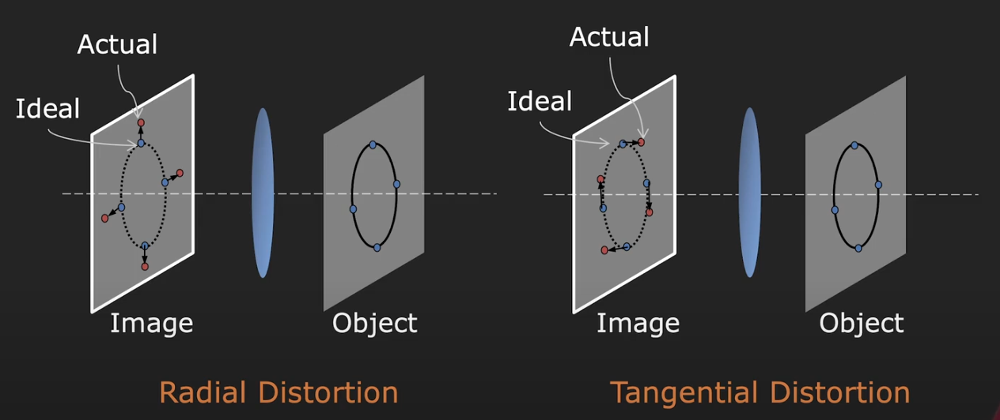

# 相机标定 (Camera Calibration)

# Projection Matrix (K, R, t)

projection matrix = intrinsic * extrinsic 

$$
P =
\begin{bmatrix}
p_{11} & p_{12} & p_{13} & p_{14} \\
p_{21} & p_{22} & p_{23} & p_{24} \\
p_{31} & p_{32} & p_{33} & p_{34} \\
\end{bmatrix} =
\begin{bmatrix}
f_x & 0     & o_x   & 0 \\
0   & f_y   & o_y   & 0 \\
0   & 0     & 1     & 0
\end{bmatrix}
\begin{bmatrix}
r_{11} & r_{12} & r_{13} & t_x \\
r_{21} & r_{22} & r_{23} & t_y \\
r_{31} & r_{32} & r_{33} & t_z \\
0      & 0      & 0      & 1
\end{bmatrix}
$$

or :

$$
P =
\begin{bmatrix}
p_{11} & p_{12} & p_{13} & p_{14} \\
p_{21} & p_{22} & p_{23} & p_{24} \\
p_{31} & p_{32} & p_{33} & p_{34} \\
\end{bmatrix} =
\begin{bmatrix}
f_x & s     & o_x & 0 \\
0   & f_y   & o_y & 0 \\
0    & 0    & 1   & 0
\end{bmatrix}
\begin{bmatrix}
r_{11} & r_{12} & r_{13} & t_x \\
r_{21} & r_{22} & r_{23} & t_y \\
r_{31} & r_{32} & r_{33} & t_z \\
0 & 0 & 0 & 1
\end{bmatrix}
$$

ps:

$(f_x, f_y) -\text{Focal length in pixels}.$

$(o_x,o_y) - \text{Optical centre(the princaipal point), in pixels.}$ 

$s -\text{Skew coefficient, with non-zero if the image axes are not perpendicular}$

that is:

$$
P =\begin{bmatrix}
p_{11} & p_{12} & p_{13} \\
p_{21} & p_{22} & p_{23} \\
p_{31} & p_{32} & p_{33}  \\\end{bmatrix}=\begin{bmatrix}
f_x & s   & o_x \\
0   & f_y & o_y \\ 
0   & 0   & 1 \end{bmatrix}\begin{bmatrix}
r_{11} & r_{12} & r_{13}  \\
r_{21} & r_{22} & r_{23}  \\
r_{31} & r_{32} & r_{33} \end{bmatrix} =KR
$$

$$
\begin{bmatrix}
p_{14} \\
p_{24} \\
p_{34}
\end{bmatrix} 
=
\begin{bmatrix}
f_x & 0   & o_x  \\
0   & f_y & o_y  \\
0   & 0   & 1    
\end{bmatrix} 
\begin{bmatrix}
t_x \\
t_y \\
z_x
\end{bmatrix}
=Kt
$$

solution:

1. as for $P=KR$ , 

$K$ is an Upper Right Triangular matrix .

$R$ is an Orthonormal matrix .

It is posible to uniquely “decouple” K and R from their product

using “QR factorization” 

1. as for $Kt$

$t = K^{-1}
\begin{bmatrix}
p_{14} \\
p_{24} \\
p_{34}
\end{bmatrix}$ 

# Other Intrinsic Parameters (Distortion)

Pinholes do not exhibit image distortions. But, lenses do !

So the intrinsic model of the camera will need to include the distortion coefficients, which is non-linear factors. 

The distortion of lenses camera involved Radial Distortion and Tangential Distortion.

cite:

1. YouTube Video

[https://www.youtube.com/watch?v=2XM2Rb2pfyQ](https://www.youtube.com/watch?v=2XM2Rb2pfyQ)

1. MATLAB Documentation

https://ww2.mathworks.cn/help/vision/ug/camera-calibration.html